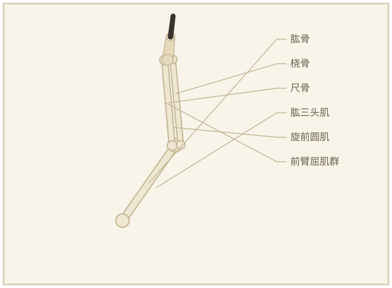

# 🏸 羽球动作库 · Badminton Moves Dataset

[English](README.md) | **简体中文**

<p>
  
  
</p>
<p>
  
  
  
</p>

> 上面的预览是**由数据规格直接烘焙的动画 SVG**（`tools/gen_readme_media.py` 生成）——整个仓库没有任何视频或 GIF 素材。

羽毛球动作解析数据集 + 交互查看器，结构参考 [exercises-dataset](https://github.com/hasaneyldrm/exercises-dataset) 的「JSON 数据层 + 每动作动画 + index.html 浏览器」模式。

与健身数据集的关键差异：羽毛球没有可用的免版权动图库，所以**动画由自绘 SVG 引擎按数据规格实时渲染**——无媒体文件、无版权问题、完全离线可用。

## 内容

当前 **32 个动作**，六个分类：

| 分类 | 前缀 | 数量 | 动画类型 |
|---|---|---|---|
| 步伐 | `fw-` | 7 | 球场俯视：移动路径 / 步子类型 / 来球轨迹 |
| 双打 | `db-` | 6 | **俯视双人同步动画**（实心=你、空心=搭档），多拍球路还原完整回合 |
| 手法 | `sk-` | 8 | **弧线视图**（侧视全场球路对比：主示范实线 / 变化虚线 / 反面示范红线）；搓放另配侧视姿态，勾对角用俯视 |
| 启动与重心 | `st-` | 4 | 时机轴（垫步）、俯视（回收/变向）、站位覆盖 |
| 发力技巧 | `pw-` | 4 | **每个动作三视角**：全身模型发力部位标红（力量沿小腿→髋→核心→大臂→小臂→手指逐级点亮，健身图鉴风格）／医学解剖特写（内旋时桡骨跨过尺骨）／发力链时序 |
| 防守 | `df-` | 3 | 俯视 + 来球轨迹 |

每条记录包含：中英文名、分类、难度、概述、要点、常见错误、训练方法、相关动作、动画规格、预留视频链接字段。

## 文件结构

```
badminton-moves/
├── index.html            # 查看器：分类筛选 + 搜索 + 六种动画引擎
├── data/
│   ├── moves.json        # 数据源（真源，供程序使用）
│   ├── moves.js          # 由 moves.json 生成，供 index.html 以 file:// 直接打开
│   └── moves.schema.json # JSON Schema
├── media/                # README 用的动画 SVG 预览
├── tools/
│   └── gen_readme_media.py  # 从 moves.json 烘焙动画 SVG
├── README.md             # English
└── README.zh-CN.md       # 本文件
```

## 使用

直接双击打开 `index.html` 即可（数据经 `moves.js` 加载，不受 file:// CORS 限制）。

修改数据后重新生成 `moves.js`：

```bash
python3 -c "
import json
d=json.load(open('data/moves.json'))
open('data/moves.js','w').write('window.BADMINTON_MOVES = '+json.dumps(d,ensure_ascii=False,indent=1)+';')"
```

## 动画坐标系

单打半场俯视，单位厘米：`x` 0–610（面向球网从左到右），`y` 0 = 球网，`y` 670 = 底线，`y < 0` = 对手半场（压缩条，用作来球起点）。发球线 y=198，双打后发球线 y=594，单打边线 x=46 / x=564，中线 x=305。

## 扩展一个动作

在 `data/moves.json` 追加一条记录（对照 `moves.schema.json`），选一种动画类型：

- `footwork`：给出 `phases`（位置 + 步子类型 + 标签 + 时长），可选 `shuttle` 来球（单个对象或数组，多拍回合按 `at` 阶段依次飞行）；可选 `phases2` 加双打搭档（空心标记，与 `phases` 等长同步移动）
- `chain`：给出发力链 `nodes`（标题 + 说明，`hit:true` 标记触球环节）
- `timing`：给出时间轴 `events`（0–1 时刻 + 标签，`hit:true` 为对手击球）
- `stance`：给出 `player` 位置和 `zones` 覆盖区
- `anatomy`：持拍臂局部解剖特写——关节角度＋`pron` 0–1（桡骨交叉程度=旋前）＋各肌肉激活度 0–1，`show` 指定绘制并标注哪些肌肉
- `figure`：侧视人体模型关键帧——每帧一组关节角度（大臂/小臂/拍/躯干/双腿），`focus` 高亮当前发力主角，`spin` 显示内旋/外旋箭头，`hit` 在帧末触发击球闪光；角度约定与连续性规则见 schema 中 `animFigure` 的描述
- `trajectory`：侧视全场球路弧线——每条弧线给 `from/apex/to`（[x, 高度cm]，网在 x=670），`kind` 区分主示范/变化/反面示范；过网弧线应在 x=670 处高于 155cm（网高）

一条记录还可以加可选的 `anim2`（任意类型），查看器会显示双动画切换标签（发力类动作即"侧视姿态 / 发力链"双视角）。

重新生成 `moves.js` 即可，查看器无需改动。
